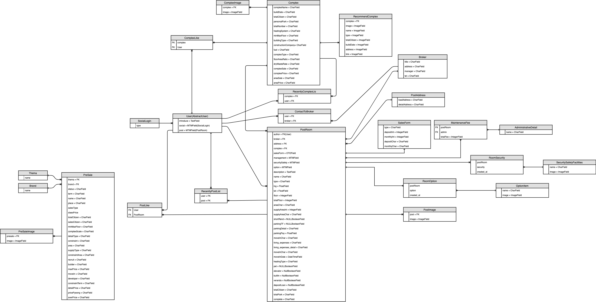

# dabang Back-End
## intro
> 패스트캠퍼스 다방 클론 프로젝트 

### 프로젝트 개발 환경 및 프로그램
- AWS ECS
- AWS S3
- Docker 
- python
- Nginx
- gunicorn


## deploy Ec2
[dabang-loadbalancer-779366673.ap-northeast-2.elb.amazonaws.com](dabang-loadbalancer-779366673.ap-northeast-2.elb.amazonaws.com)

## installation

### requirements
- python 3.7.4
- django 2.2.12

```
pip install -r requiremens.text
```

### Secrets

```json 
# .secrets/secret.json
{
{
  "SECRET_KEY": "<django key>",
  "FACEBOOK_APP_ID": "<facebook APP ID>",
  "FACEBOOK_APP_SECRET": "<facebook app secret>",
  "KAKAO_APP_ID": "< kakao app id>",
  "AWS": {
    "AWS_S3_KEY_ID": "<AWS s3 key>",
    "AWS_S3_SECRET_ACCESS_KEY": "<aws s3 secret>"
  }
}

}

# dev.json, production.json 
{
  "DATABASES": {
    "default": {
        "ENGINE": "django.db.backends.sqlite3",
        "NAME": "db.sqlite3"
    }
  }
}
```

### ERD



### API Docs

[https://app.gitbook.com/@dabowang/s/dabang/](https://app.gitbook.com/@dabowang/s/dabang/)
